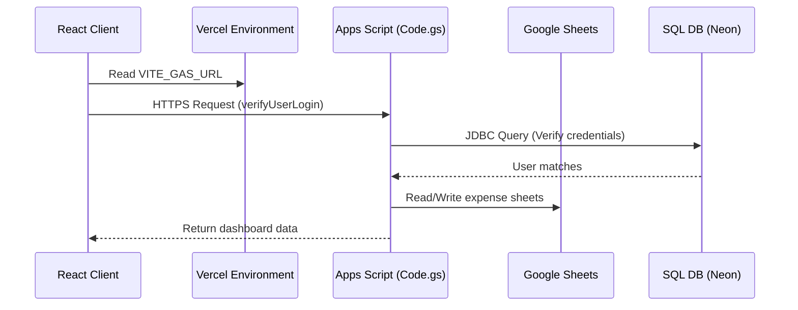

# IEEE Event Expenses & Bookkeeping Manager

A premium, modern, and mobile-friendly web application designed to track event expected budgets and actual spent expenses, synced in real-time with Google Sheets and secured using an external SQL database backend (compatible with MySQL and Neon PostgreSQL).

---

## 🎨 Premium Features

- **Redesigned Glassmorphic Login Portal**: Features floating background blobs, backdrop-blur saturation filters, and interactive auth tabs (Sign In / Create Account).
- **Password Visibility Toggles**: Interactive eye icons toggle passcodes between password masking and plain-text.
- **Forget Password Recovery**: Auto-emails forgotten passcodes after matching security questions in a step-by-step progress timeline.
- **Vercel Environment Variables**: Connection parameters (GAS URL, Spreadsheet IDs) are managed via `.env` (locally) and Vercel Environment Variables (production), keeping credentials out of public repositories.
- **Consolidated Backend Storage**: Expenses data is stored in Google Sheets, while credentials and session logs are managed securely in an external SQL database (e.g. Neon PostgreSQL).

---

## 🏗️ Architecture

This application consists of two parts:
1. **Frontend (React + Vite + Vanilla CSS):** Deployed on Vercel. Configured via environment variables with a simplified account settings modal for personal profile passcode updates.
2. **Backend (Google Apps Script + SQL Database):** Runs on Google's serverless environment, coordinating Sheets database writes and JDBC socket updates to your SQL database.



---

## 🚀 Deployment Instructions

### Step 1: Deploy your SQL Database (Neon PostgreSQL)
1. Sign up on [Neon.tech](https://neon.tech/) and create a project.
2. In the console, retrieve your connection details. Note the host, database name (`neondb`), username, and password.

### Step 2: Deploy the Google Apps Script Backend
1. Create a Google Sheet to track expenses.
2. Go to **Extensions** ➔ **Apps Script**.
3. Replace the contents of the script file with the code inside the local `Code.gs` file.
4. Configure your database coordinates at the top of `Code.gs`:
   ```javascript
   var DB_URL = "jdbc:postgresql://your-neon-hostname.neon.tech/neondb?ssl=true&sslmode=require";
   var DB_USER = "neondb_owner";
   var DB_PASSWORD = "yourPasswordHere";
   ```
5. Click **Deploy** ➔ **New deployment**. Select **Web app** as type.
   - **Execute as:** `Me (your-email@gmail.com)`
   - **Who has access:** `Anyone`
6. Authorize the permissions and copy the generated **Web App URL** (ends in `/exec`).

### Step 3: Run the React Application Locally
1. Copy the `.env.example` template into a new `.env` file:
   ```bash
   cp .env.example .env
   ```
2. Open `.env` and fill in your copied Apps Script Web App URL and Spreadsheet IDs:
   ```env
   VITE_GAS_URL=https://script.google.com/macros/s/.../exec
   VITE_SPREADSHEET_ID=your-google-sheet-id
   VITE_BOOKKEEPING_SS_ID=your-bookkeeping-sheet-id
   ```
3. Run the following terminal commands:
   ```bash
   npm install
   npm run dev
   ```
4. Open `http://localhost:5173`. The application automatically reads connection parameters and logs you into the database portal.

### Step 4: Deploying to Vercel
1. Push your workspace files to a private GitHub repository.
2. Import the repository in [Vercel](https://vercel.com).
3. Under **Environment Variables**, configure the same keys:
   - `VITE_GAS_URL`
   - `VITE_SPREADSHEET_ID`
   - `VITE_BOOKKEEPING_SS_ID`
4. Deploy the site.

---

## 🛡️ Database Verification & Auditing
Since settings pages do not display credential records for security, run standard SQL queries inside your database manager (e.g. phpMyAdmin, pgAdmin, DBeaver) to review audit details:

* **To see registered accounts:**
  ```sql
  SELECT * FROM users;
  ```
* **To check logins and logouts:**
  ```sql
  SELECT * FROM login_logs ORDER BY id DESC;
  ```
